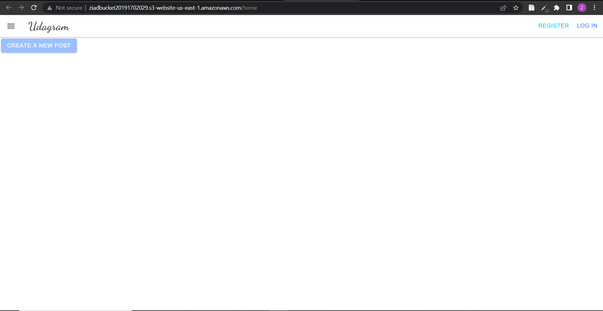

# Hosting a Full-Stack Application


In this project a newly developed Full-Stack application was built for a retailer and deployed it to a cloud service provider so that it is available to customers. I used the aws console to start and configure the services the application needs such as a database to store product information and a web server allowing the site to be discovered by potential customers. 

After the initial setup, I interacted with the services I started on aws and deployed the application.

I then registered for a free account on CircleCi and connected it to Github. Based on the manual steps used to deploy the app, I wrote a config.yml file that will make the process reproducible in CircleCi. I set up the process to be executed automatically based when code is pushed on the main Github branch.

The project will also include writing documentation and runbooks covering the operations of the deployment process. Those runbooks will serve as a way to communicate with future developers and anybody involved in diagnosing outages of the Full-Stack application.


### Dependencies

```
- Node v16.0.0 (LTS) or more recent.

- npm 6.14.8 (LTS) or more recent, Yarn can work but was not tested for this project

- AWS CLI v2, v1 can work but was not tested for this project

- A RDS database running Postgres.

- A S3 bucket for hosting uploaded pictures.

```
### Link to hosted working frontend application.
```
http://ziadbucket20191702029.s3-website-us-east-1.amazonaws.com
```
### Screenshot of the working application
;