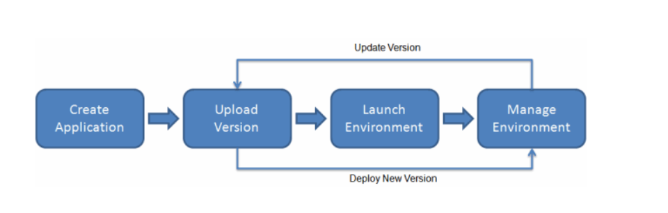

### S3
Amazon Simple Storage Service (Amazon S3) is an object storage service that was used to host the frontend application. All objects are stored in what is called buckets.

### Elasticbeanstalk (EC2)
With Elastic Beanstalk, you can quickly deploy and manage applications in the AWS Cloud without having to learn about the infrastructure that runs those applications.

And here is an image from the aws documentation.

### RDS
Relational Database Service allows you to host your application database to amazon servers depending on your database type which in our case is POSTGRES 